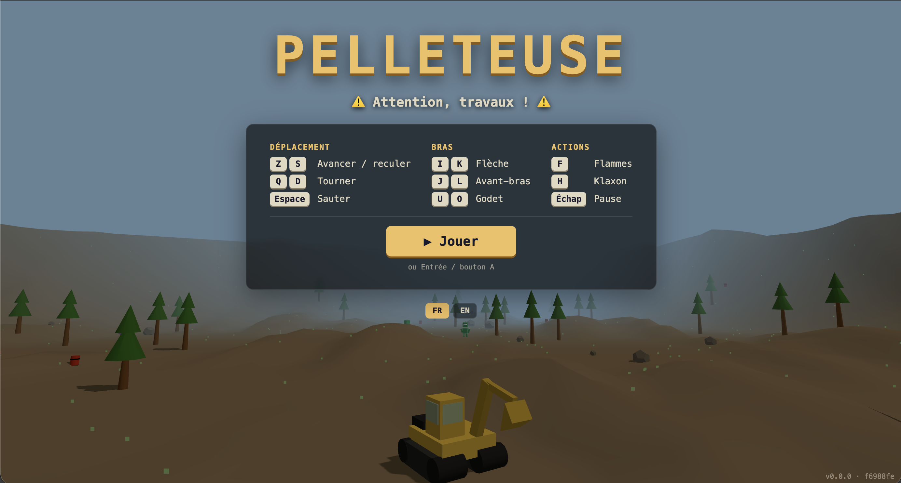

# 🚜 Pelleteuse

Jeu 3D arcade dans le navigateur : pilotez une pelleteuse et semez le chaos sur le chantier.

**▶ Jouer : https://radiium.github.io/pelleteuse/**

[](https://radiium.github.io/pelleteuse/)

## Le jeu

Roulez sur le terrain et foncez dans tout ce qui se trouve sur votre passage :

- 🪨 **Rochers** : ils volent en éclats
- 🌲 **Arbres** : ils se brisent
- 🛢️ **Barils** : ils explosent
- 👾 **Monstres** : ils s'enfuient quand vous approchez… rattrapez-les !

Un compteur affiche en haut de l'écran le nombre d'objets détruits de chaque type.

Le jeu est disponible en français et en anglais, et se joue au clavier ou à la manette.

## Contrôles

| Action | Clavier | Manette |
|---|---|---|
| Avancer / reculer | `Z` / `S` | Stick gauche ↕ |
| Tourner | `Q` / `D` | Stick gauche ↔ |
| Sauter | `Espace` | `X` |
| Flèche (bras) | `I` / `K` | Croix ↕ |
| Avant-bras | `J` / `L` | Stick droit ↔ |
| Godet | `U` / `O` | Stick droit ↕ |
| Flammes | `F` | `A` |
| Klaxon | `H` | `B` |
| Pause / menu | `Échap` | `Start` |

Les touches sont indiquées pour un clavier AZERTY ; elles suivent la position physique des touches, donc sur un clavier QWERTY c'est `W A S D`.

## Développement

Prérequis : [Node.js](https://nodejs.org/) 24 et [pnpm](https://pnpm.io/).

```bash
pnpm install
pnpm dev        # serveur de développement
pnpm build      # vérification TypeScript + build de production dans dist/
pnpm preview    # sert le build de production en local
```

Le build produit un unique `index.html` autonome (JS et CSS inclus) grâce à `vite-plugin-singlefile`.

### Stack

- [Three.js](https://threejs.org/) pour le rendu 3D
- [TypeScript](https://www.typescriptlang.org/) en mode strict
- [Vite](https://vite.dev/) pour le build et le serveur de développement

### Déploiement

Chaque push sur `main` déclenche le workflow GitHub Actions (`.github/workflows/deploy.yml`), qui build le jeu et le publie sur GitHub Pages. La version et le commit déployés sont affichés en bas à droite du menu.

## Licence

[MIT](LICENSE)
